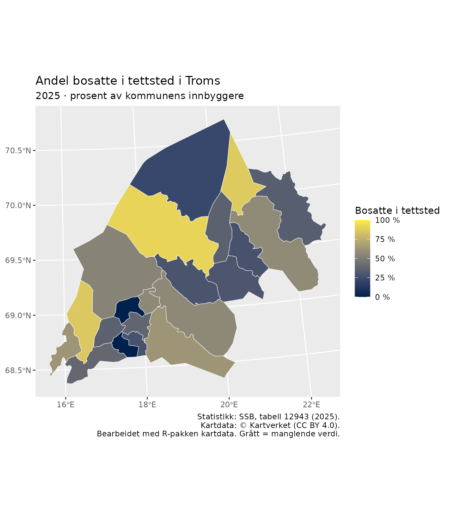
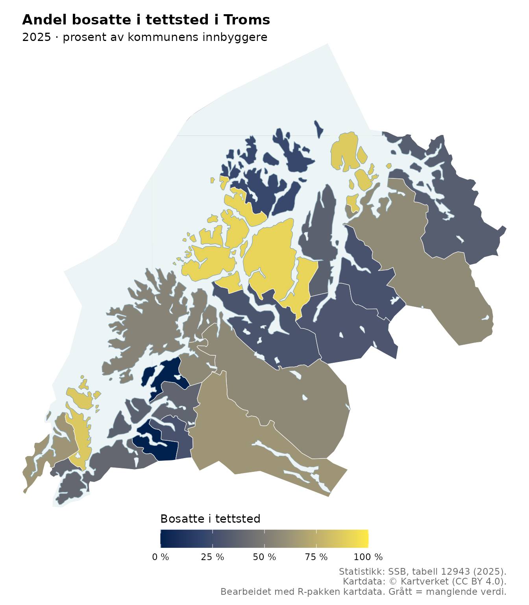

# Koroplet: fra prosenttabell til kommunekart

Et [koropletkart](https://snl.no/koroplet) gir hvert geografisk område
en farge etter en tallverdi. Her fargelegger vi kommunene i Troms etter
**andelen bosatte i tettsted**. En verdi på 91 betyr at 91 av 100
innbyggere bor i tettsted. Det betyr ikke at 91 prosent av kommunens
areal er tettsted.

Vi skal først klargjøre en prosenttabell, deretter koble den til
kommunegrenser, og til slutt gjøre kartet lettere å lese med en tydelig
fargeskala og vannflater.

## 1. Last pakkene

Vi bruker `kartdata` til å hente kart, `dplyr` til å koble tabeller og
`ggplot2` til å tegne. `sf` håndterer geometri, og `tibble` brukes til å
skrive eksempeldataene som en liten tabell.

``` r

# Installer ved behov:
# install.packages(c("dplyr", "ggplot2", "tibble"))

library(kartdata)
library(dplyr)
library(ggplot2)
```

## 2. Klargjør prosentdataene

Én rad skal beskrive én kommune. Vi bruker det korte kolonnenavnet
`andel_tettsted` i koden og setter en mer forklarende tekst i kartets
tegnforklaring.

Tallene er fra [SSB, tabell
12943](https://www.ssb.no/statbank/table/12943): velg kommunene i Troms,
statistikkvariabelen **Andel bosatte i tettsted (prosent)** og året
**2025**. Tabellen nedenfor gjengir disse prosentverdiene. Vi skriver
dem direkte i koden for å konsentrere oss om koblingen til kartet. I en
automatisert analyse kan samme tabell hentes direkte fra SSBs
[API](https://www.ssb.no/api/pxwebapi).

``` r

prosentdata <- tibble::tribble(
                                   ~kommune, ~andel_tettsted,
                              "5501 Tromsø",             91,
                  "5503 Harstad - Hárstták",             86,
                            "5510 Kvæfjord",             63,
           "5512 Dielddanuorri - Tjeldsund",             39,
                             "5514 Ibestad",             36,
                 "5516 Gratangen - Rivtták",              0,
                   "5518 Loabák - Lavangen",             28,
                               "5520 Bardu",             63,
                            "5522 Salangen",             38,
                             "5524 Målselv",             57,
                            "5526 Sørreisa",             57,
                               "5528 Dyrøy",              0,
                               "5530 Senja",             54,
                           "5532 Balsfjord",             29,
                             "5534 Karlsøy",             22,
               "5536 Lyngen - Ivgu - Yykeä",             36,
  "5538 Storfjord - Omasvuotna - Omasvuono",             30,
      "5540 Gáivuotna - Kåfjord - Kaivuono",             28,
                            "5542 Skjervøy",             87,
           "5544 Nordreisa - Ráisa - Raisi",             58,
                           "5546 Kvænangen",             34
  )
```

### Bruk kommunenummer som koblingsnøkkel

Navn kan ha flere språkformer og skrivemåter. Derfor kobler vi på
**kommunenummer**, ikke kommunenavn. I denne tabellen er de fire første
tegnene koden. Vi lagrer den som tekst, slik at eventuelle ledende
nuller beholdes.

``` r

prosentdata <- prosentdata |>
  mutate(kommunenummer = substr(kommune, 1, 4))

stopifnot(
  !anyNA(prosentdata$kommunenummer),
  all(grepl("^[0-9]{4}$", prosentdata$kommunenummer)),
  !anyDuplicated(prosentdata$kommunenummer),
  all(is.na(prosentdata$andel_tettsted) |
        prosentdata$andel_tettsted >= 0 & prosentdata$andel_tettsted <= 100)
)
```

Kontrollene stopper koden hvis kommunenummer mangler, er feil formatert
eller forekommer flere ganger, eller hvis en prosent er utenfor 0–100. I
egne data bør kommunenummer helst komme i en egen tekstkolonne allerede
ved innlesing.

**Null og manglende verdi er forskjellige:** `0` betyr her null prosent,
mens `NA` betyr at vi ikke har en verdi. Ikke erstatt `NA` med null for
å få hele kartet fargelagt.

## 3. Hent kommunegrensene

N2000 er et generalisert kartgrunnlag som vi bruker til et
oversiktskart. For mer detaljerte kart kan du velge en annen serie.

``` r

series <- "N2000"
area_name <- "Troms"

omrader <- n_areas(series)
subset(omrader, name == area_name)
#>    area  name  epsg format
#> 55   55 Troms 25833   FGDB
#> 56   55 Troms 25833    GML
```

[`n_areas()`](https://hmalmedal.github.io/kartdata/reference/n_areas.md)
viser publiserte områder, formater og koordinatsystemer. Den henter bare
metadata. Neste kall,
[`n_layers()`](https://hmalmedal.github.io/kartdata/reference/n_layers.md),
trenger selve arkivet og kan derfor utløse nedlasting.

``` r

lag <- n_layers(series = series, area = area_name)
"Kommune" %in% lag
#> [1] TRUE

kommuner <- n_get("Kommune", series = series, area = area_name)
names(kommuner)
#> [1] "objtype"          "navn"             "oppdateringsdato" "kommunenummer"   
#> [5] "SHAPE_Length"     "SHAPE_Area"       "SHAPE"
sf::st_crs(kommuner)$input
#> [1] "ETRS89 / UTM zone 33N"
sf::st_crs(kommuner)$epsg
#> [1] 25833

stopifnot("kommunenummer" %in% names(kommuner))
kommuner <- kommuner |>
  mutate(kommunenummer = as.character(kommunenummer))
```

`kommuner` er et `sf`-objekt: en tabell som også inneholder geometri. Vi
trenger både kommunenummeret og geometrien videre. Ingen reprojisering
er nødvendig her, siden alle kartlag hentes med samme serie, område og
standard-EPSG.

Statistikken gjelder 2025, mens `kartdata` henter det publiserte
kartgrunnlaget som er tilgjengelig ved nedlasting. Ved arbeid med
historisk statistikk må du kontrollere at kommunegrensene passer til
statistikkåret. Like kommunenummer er en nødvendig kontroll, men
garanterer ikke uendrede grenser.

## 4. Kontroller koblingen før du tegner

Først finner vi kommunenumrene i kartet. `st_drop_geometry()` fjerner
geometrien fra denne kontrolltabellen, og
[`distinct()`](https://dplyr.tidyverse.org/reference/distinct.html) gir
én rad per kode.

``` r

kartnokler <- kommuner |>
  sf::st_drop_geometry() |>
  distinct(kommunenummer)

data_uten_kart <- anti_join(prosentdata, kartnokler, by = "kommunenummer")
kart_uten_data <- anti_join(kartnokler, prosentdata, by = "kommunenummer")

data_uten_kart
#> # A tibble: 0 × 3
#> # ℹ 3 variables: kommune <chr>, andel_tettsted <dbl>, kommunenummer <chr>
kart_uten_data
#> [1] kommunenummer
#> <0 rows> (or 0-length row.names)
```

Begge tabellene bør være tomme når områdene og kodene passer sammen.

- **`data_uten_kart` har rader:** Noen statistikkrader kan ikke
  plasseres på kartet. Undersøk kodefeil, feil område eller endret
  kommuneinndeling.
- **`kart_uten_data` har rader:** Noen kommuner mangler statistikk. Vi
  beholder dem i kartet og viser dem med en egen gråfarge.

Nå legger vi prosentkolonnen til karttabellen:

``` r

prosentkartdata <- kommuner |>
  left_join(
    select(prosentdata, kommunenummer, andel_tettsted),
    by = "kommunenummer",
    relationship = "many-to-one"
  )

stopifnot(
  inherits(prosentkartdata, "sf"),
  nrow(prosentkartdata) == nrow(kommuner)
)

prosentkartdata |>
  sf::st_drop_geometry() |>
  select(kommunenummer, andel_tettsted)
#>    kommunenummer andel_tettsted
#> 1           5534             22
#> 2           5510             63
#> 3           5522             38
#> 4           5516              0
#> 5           5532             29
#> 6           5514             36
#> 7           5542             87
#> 8           5524             57
#> 9           5536             36
#> 10          5518             28
#> 11          5501             91
#> 12          5530             54
#> 13          5544             58
#> 14          5503             86
#> 15          5538             30
#> 16          5512             39
#> 17          5528              0
#> 18          5520             63
#> 19          5540             28
#> 20          5546             34
#> 21          5526             57
```

Ved å starte med karttabellen og bruke
[`left_join()`](https://dplyr.tidyverse.org/reference/mutate-joins.html)
beholder vi alle kartobjektene og geometrien. Et
[`inner_join()`](https://dplyr.tidyverse.org/reference/mutate-joins.html)
ville fjernet objekter uten treff. `relationship = "many-to-one"` krever
at hvert kartobjekt har høyst én statistikkrad; flere geometrirader for
samme kommune er tillatt.

## 5. Tegn et enkelt koropletkart

[`geom_sf()`](https://ggplot2.tidyverse.org/reference/ggsf.html) tegner
geometrien. Inne i
[`aes()`](https://ggplot2.tidyverse.org/reference/aes.html) knytter vi
fyllfargen til prosentkolonnen. Faste egenskaper, som fargen på
grensene, står utenfor
[`aes()`](https://ggplot2.tidyverse.org/reference/aes.html).

``` r

enkelt_kart <- ggplot(prosentkartdata) +
  geom_sf(aes(fill = andel_tettsted), colour = "white", linewidth = 0.2) +
  scale_fill_viridis_c(
    option = "cividis",
    limits = c(0, 100),
    breaks = seq(0, 100, 25),
    labels = function(x) paste0(x, " %"),
    na.value = "#BDBDBD",
    name = "Bosatte i tettsted"
  ) +
  labs(
    title = "Andel bosatte i tettsted i Troms",
    subtitle = "2025 · prosent av kommunens innbyggere",
    caption = paste("Statistikk: SSB, tabell 12943 (2025).",
                    "Kartdata: © Kartverket (CC BY 4.0).",
                    "Bearbeidet med R-pakken kartdata. Grått = manglende verdi.",
                    sep = "\n")
  )

enkelt_kart
```



Vi bruker
[cividis-skalaen](https://ggplot2.tidyverse.org/reference/scale_viridis.html),
som har en ordnet lyshetsgradient og er utformet med tanke på fargesyn.
Grensene `c(0, 100)` gjør at samme prosent får samme farge i flere kart.
En automatisk skala kunne gitt ulike farger for samme verdi i ulike
utsnitt.

Tallene er allerede prosenter fra 0 til 100. Derfor legger
etikettfunksjonen bare til prosenttegnet; den skal ikke multiplisere
tallene med 100.

## 6. Gjør geografien lettere å kjenne igjen

Et kommunekart følger administrative grenser, som også kan gå ut i
sjøen. Da kan kommuneformene være vanskelige å kjenne igjen. Vi legger
derfor vannflater over kommunefargene og tegner kystlinjen øverst.

``` r

hav <- n_get("Havflate", series = series, area = area_name)
innsjoer <- n_get("Innsjø", series = series, area = area_name)
kyst <- n_get("Kystkontur", series = series, area = area_name)
```

Dette er flere lag fra samme arkiv, så filene kan gjenbrukes fra cache.
Selve innlesingen av hvert nytt lag tar fortsatt tid.

**Rekkefølgen på lagene betyr noe:** Det siste laget tegnes øverst. Her
tegner vi kommunene først, vannet over og kystkonturen til slutt.
Vannflatene endrer bare hva vi ser, ikke kommunenes prosentverdier.

``` r

vannfarge <- "#EDF4F6"
kystfarge <- "#8BAAB8"
utsnitt <- sf::st_bbox(kommuner)

ferdig_kart <- enkelt_kart +
  geom_sf(data = hav, inherit.aes = FALSE,
          fill = vannfarge, colour = NA) +
  geom_sf(data = innsjoer, inherit.aes = FALSE,
          fill = vannfarge, colour = kystfarge, linewidth = 0.15) +
  geom_sf(data = kyst, inherit.aes = FALSE,
          colour = kystfarge, linewidth = 0.25) +
  coord_sf(
    xlim = unname(utsnitt[c("xmin", "xmax")]),
    ylim = unname(utsnitt[c("ymin", "ymax")]),
    expand = FALSE
  ) +
  guides(fill = guide_colourbar(
    title.position = "top", barwidth = grid::unit(7, "cm")
  )) +
  theme_void() +
  theme(
    legend.position = "bottom",
    plot.margin = margin(8, 8, 8, 8),
    plot.title = element_text(face = "bold"),
    plot.caption = element_text(colour = "grey40")
  )

ferdig_kart
```



`inherit.aes = FALSE` holder vann- og kystlagene uavhengige av kartets
øvrige estetiske koblinger.
[`coord_sf()`](https://ggplot2.tidyverse.org/reference/ggsf.html) holder
utsnittet fast selv om et bakgrunnslag strekker seg lenger.
[`theme_void()`](https://ggplot2.tidyverse.org/reference/ggtheme.html)
fjerner akser og rutenett, mens tegnforklaringen og kildeopplysningene
beholdes.

Kommunegrensene er allerede tegnet av det første laget. Flere grenselag
kan legges til dersom de hjelper leseren, men alle tilgjengelige lag
trenger ikke være med i kartet.

## 7. Tolk og publiser kartet

Kartet sammenligner **andeler i kommuner**, ikke antall innbyggere eller
plasseringen av tettstedene. En stor kommune får mye plass på kartet
selv om den har få innbyggere. En farge gjelder kommunens samlede verdi
og sier ikke at alle deler av kommunen har samme bosettingsmønster.

Før du publiserer et kart med egne data:

- Oppgi kilde og årstall for statistikken, og kontroller at
  kommuneinndelingen passer til statistikkåret.
- Undersøk radene som ikke fikk treff i koblingen. Behold skillet mellom
  null og manglende verdi.
- Oppgi enhet og bruk samme fargeskala hvis flere kart skal
  sammenlignes.
- Krediter kartgrunnlaget og opplys om egne endringer. Kartverkets data
  er [CC BY 4.0](https://creativecommons.org/licenses/by/4.0/); se også
  [Kartverkets
  bruksvilkår](https://www.kartverket.no/api-og-data/vilkar-for-bruk).

Du kan lagre kartet med:

``` r

ggsave("troms-koroplet.png", ferdig_kart, width = 18, height = 22,
       units = "cm", dpi = 300, bg = "white")
```

Se [Cache, oppdatering og
ytelse](https://hmalmedal.github.io/kartdata/articles/cache.md) for
raskere gjentatt bruk og [Forstå
kartdataene](https://hmalmedal.github.io/kartdata/articles/data-og-formater.md)
for mer om formater og attributter.
